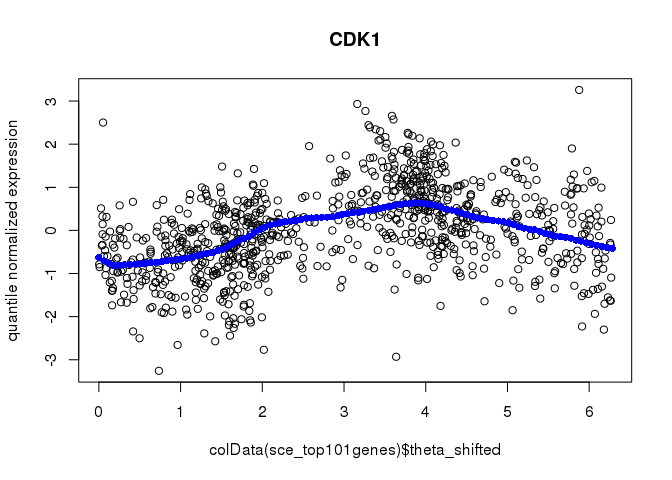

[](https://travis-ci.com/jhsiao999/peco)
[](https://ci.appveyor.com/project/jhsiao999/peco)
[](https://circleci.com/gh/jhsiao999/peco)
[](http://www.gnu.org/licenses/gpl-3.0)

# peco

**peco** is an R package for **P**r**E**dicting **C**ell cycle
pr**O**gression in a continuum using scRNA-seq data.

## Installation

To install and load the package, run:

``` r
install.packages("devtools")
library(devtools)
install_github("jhsiao999/peco")
```

`peco` uses `SingleCellExperiment` class objects.

``` r
library(peco)
library(SingleCellExperiment)
```

    ## Loading required package: SummarizedExperiment

    ## Loading required package: GenomicRanges

    ## Loading required package: stats4

    ## Loading required package: BiocGenerics

    ## Loading required package: parallel

    ## 
    ## Attaching package: 'BiocGenerics'

    ## The following objects are masked from 'package:parallel':
    ## 
    ##     clusterApply, clusterApplyLB, clusterCall, clusterEvalQ,
    ##     clusterExport, clusterMap, parApply, parCapply, parLapply,
    ##     parLapplyLB, parRapply, parSapply, parSapplyLB

    ## The following objects are masked from 'package:stats':
    ## 
    ##     IQR, mad, sd, var, xtabs

    ## The following objects are masked from 'package:base':
    ## 
    ##     anyDuplicated, append, as.data.frame, basename, cbind,
    ##     colMeans, colnames, colSums, dirname, do.call, duplicated,
    ##     eval, evalq, Filter, Find, get, grep, grepl, intersect,
    ##     is.unsorted, lapply, lengths, Map, mapply, match, mget, order,
    ##     paste, pmax, pmax.int, pmin, pmin.int, Position, rank, rbind,
    ##     Reduce, rowMeans, rownames, rowSums, sapply, setdiff, sort,
    ##     table, tapply, union, unique, unsplit, which, which.max,
    ##     which.min

    ## Loading required package: S4Vectors

    ## 
    ## Attaching package: 'S4Vectors'

    ## The following object is masked from 'package:base':
    ## 
    ##     expand.grid

    ## Loading required package: IRanges

    ## Loading required package: GenomeInfoDb

    ## Loading required package: Biobase

    ## Welcome to Bioconductor
    ## 
    ##     Vignettes contain introductory material; view with
    ##     'browseVignettes()'. To cite Bioconductor, see
    ##     'citation("Biobase")', and for packages 'citation("pkgname")'.

    ## Loading required package: DelayedArray

    ## Loading required package: matrixStats

    ## 
    ## Attaching package: 'matrixStats'

    ## The following objects are masked from 'package:Biobase':
    ## 
    ##     anyMissing, rowMedians

    ## Loading required package: BiocParallel

    ## 
    ## Attaching package: 'DelayedArray'

    ## The following objects are masked from 'package:matrixStats':
    ## 
    ##     colMaxs, colMins, colRanges, rowMaxs, rowMins, rowRanges

    ## The following objects are masked from 'package:base':
    ## 
    ##     aperm, apply

``` r
library(doParallel)
```

    ## Loading required package: foreach

    ## Loading required package: iterators

``` r
library(foreach)
```

## Overview

`peco` is a supervised approach for PrEdicting cell cycle phase in a
COntinuum using single-cell RNA sequencing data. The R package provides
functions to build training dataset and also functions to use existing
training data to predict cell cycle on a continuum.

Our work demonstrated that peco is able to predict continuous cell cylce
phase using a small set of cylcic genes: *CDK1*, *UBE2C*, *TOP2A*,
*HISTH1E*, and *HISTH1C* (identified as cell cycle marker genes in
studies of yeast ([Spellman et
al., 1998](https://www.ncbi.nlm.nih.gov/pmc/articles/PMC25624)) and HeLa
cells ([Whitfield et
al., 2002](https://www.ncbi.nlm.nih.gov/pmc/articles/PMC117619))).

Below we provide two use cases. Vignette 1 shows how to use the
built-training dataset to predict continuous cell cycle. Vignette 2
shows how to make a training datast and build a predictor using training
data.

Users can also view the vigenettes via `browseVignettes("peco")`.

## About the training dataset

`training_human` stores built-in training data of 101 significant cyclic
genes. Below are the slots contained in `training_human`:

  - `predict.yy`: a gene by sample matrix (101 by 888) that stores
    predict cyclic expression values.
  - `cellcycle_peco_reordered`: cell cycle phase in a unit circle
    (angle), ordered from 0 to 2\(pi\)
  - `cellcycle_function`: lists of 101 function corresponding to the top
    101 cyclic genes identified in our dataset
  - `sigma`: standard error associated with cyclic trends of gene
    expression
  - `pve`: proportion of variance explained by the cyclic trend

<!-- end list -->

``` r
data("training_human")
```

## Predict cell cycle phase using gene expression data

`peco` is integrated with `SingleCellExperiment` object in Bioconductor.
Below shows an example of inputting `SingleCellExperiment` object to
perform cell cycle phase prediction.

`sce_top101genes` includes 101 genes and 888 single-cell samples and one
assay slot of `counts`.

``` r
data("sce_top101genes")
assays(sce_top101genes)
```

    ## List of length 1
    ## names(1): counts

Transform the expression values to quantile-normalizesd
counts-per-million values. `peco` uses the `cpm_quantNormed` slot as
input data for predictions.

``` r
sce_top101genes <- data_transform_quantile(sce_top101genes)
```

    ## computing on 2 cores

``` r
assays(sce_top101genes)
```

    ## List of length 3
    ## names(3): counts cpm cpm_quantNormed

Apply the prediction model using function `cycle_npreg_outsample` and
generate prediction results contained in a list object
`pred_top101genes`.

``` r
pred_top101genes <- cycle_npreg_outsample(
    Y_test=sce_top101genes,
    sigma_est=training_human$sigma[rownames(sce_top101genes),],
    funs_est=training_human$cellcycle_function[rownames(sce_top101genes)],
    method.trend="trendfilter",
    ncores=1,
    get_trend_estimates=FALSE)
```

The `pred_top101genes$Y` contains a SingleCellExperiment object with the
predict cell cycle phase in the `colData` slot.

``` r
head(colData(pred_top101genes$Y)$cellcycle_peco)
```

    ## 20170905-A01 20170905-A02 20170905-A03 20170905-A06 20170905-A07 
    ##     1.099557     4.555309     2.481858     4.303982     4.052655 
    ## 20170905-A08 
    ##     1.413717

Visualize results of prediction for one gene. Below we choose CDK1
(“ENSG00000170312”). Because CDK1 is a known cell cycle gene, this
visualization serves as a sanity check for the results of fitting. The
fitted function `training_human$cellcycle_function[[1]]` was obtained
from our training data.

``` r
plot(y=assay(pred_top101genes$Y,"cpm_quantNormed")["ENSG00000170312",],
     x=colData(pred_top101genes$Y)$theta_shifted, main = "CDK1",
     ylab = "quantile normalized expression")
points(y=training_human$cellcycle_function[["ENSG00000170312"]](seq(0,2*pi, length.out=100)),
       x=seq(0,2*pi, length.out=100), col = "blue", pch =16)
```

<!-- -->

## Visualize cyclic expression trend based on predicted phase

Visualize results of prediction for the top 10 genesone genes. Use
`fit_cyclical_many` to estimate cyclic function based on the input data.

``` r
# predicted cell time in the input data
theta_predict = colData(pred_top101genes$Y)$cellcycle_peco
names(theta_predict) = rownames(colData(pred_top101genes$Y))

# expression values of 10 genes in the input data
yy_input = assay(pred_top101genes$Y,"cpm_quantNormed")[1:6,]

# apply trendfilter to estimate cyclic gene expression trend
fit_cyclic <- fit_cyclical_many(Y=yy_input, 
                                theta=theta_predict)
```

    ## computing on 2 cores

``` r
gene_symbols = rowData(pred_top101genes$Y)$hgnc[rownames(yy_input)]

par(mfrow=c(2,3))
for (i in 1:6) {
plot(y=yy_input[i,],
     x=fit_cyclic$cellcycle_peco_ordered, 
     main = gene_symbols[i],
     ylab = "quantile normalized expression")
points(y=fit_cyclic$cellcycle_function[[i]](seq(0,2*pi, length.out=100)),
       x=seq(0,2*pi, length.out=100), col = "blue", pch =16)
}
```

<!-- -->

## Session information

``` r
sessionInfo()
```

    ## R version 3.5.1 (2018-07-02)
    ## Platform: x86_64-pc-linux-gnu (64-bit)
    ## Running under: Scientific Linux 7.4 (Nitrogen)
    ## 
    ## Matrix products: default
    ## BLAS/LAPACK: /software/openblas-0.2.19-el7-x86_64/lib/libopenblas_haswellp-r0.2.19.so
    ## 
    ## locale:
    ##  [1] LC_CTYPE=en_US.UTF-8       LC_NUMERIC=C              
    ##  [3] LC_TIME=en_US.UTF-8        LC_COLLATE=en_US.UTF-8    
    ##  [5] LC_MONETARY=en_US.UTF-8    LC_MESSAGES=en_US.UTF-8   
    ##  [7] LC_PAPER=en_US.UTF-8       LC_NAME=C                 
    ##  [9] LC_ADDRESS=C               LC_TELEPHONE=C            
    ## [11] LC_MEASUREMENT=en_US.UTF-8 LC_IDENTIFICATION=C       
    ## 
    ## attached base packages:
    ## [1] parallel  stats4    stats     graphics  grDevices utils     datasets 
    ## [8] methods   base     
    ## 
    ## other attached packages:
    ##  [1] doParallel_1.0.14           iterators_1.0.12           
    ##  [3] foreach_1.4.4               SingleCellExperiment_1.4.1 
    ##  [5] SummarizedExperiment_1.12.0 DelayedArray_0.8.0         
    ##  [7] BiocParallel_1.16.0         matrixStats_0.55.0         
    ##  [9] Biobase_2.42.0              GenomicRanges_1.34.0       
    ## [11] GenomeInfoDb_1.18.1         IRanges_2.16.0             
    ## [13] S4Vectors_0.20.1            BiocGenerics_0.28.0        
    ## [15] peco_0.99.10               
    ## 
    ## loaded via a namespace (and not attached):
    ##  [1] Rcpp_1.0.3               mvtnorm_1.0-11          
    ##  [3] lattice_0.20-38          assertthat_0.2.1        
    ##  [5] rprojroot_1.3-2          digest_0.6.20           
    ##  [7] plyr_1.8.4               R6_2.4.0                
    ##  [9] backports_1.1.2          genlasso_1.4            
    ## [11] evaluate_0.12            pracma_2.2.9            
    ## [13] ggplot2_3.2.1            pillar_1.3.1            
    ## [15] zlibbioc_1.28.0          rlang_0.4.0             
    ## [17] lazyeval_0.2.1           Matrix_1.2-17           
    ## [19] rmarkdown_1.10           geigen_2.3              
    ## [21] stringr_1.3.1            igraph_1.2.2            
    ## [23] RCurl_1.95-4.11          munsell_0.5.0           
    ## [25] HDF5Array_1.10.1         vipor_0.4.5             
    ## [27] compiler_3.5.1           pkgconfig_2.0.3         
    ## [29] ggbeeswarm_0.6.0         htmltools_0.3.6         
    ## [31] tidyselect_0.2.5         tibble_2.1.1            
    ## [33] gridExtra_2.3            GenomeInfoDbData_1.2.0  
    ## [35] codetools_0.2-15         viridisLite_0.3.0       
    ## [37] crayon_1.3.4             dplyr_0.8.0.1           
    ## [39] MASS_7.3-51.1            bitops_1.0-6            
    ## [41] grid_3.5.1               gtable_0.2.0            
    ## [43] magrittr_1.5             scales_1.0.0            
    ## [45] stringi_1.2.4            reshape2_1.4.3          
    ## [47] XVector_0.22.0           viridis_0.5.1           
    ## [49] scater_1.10.1            DelayedMatrixStats_1.4.0
    ## [51] boot_1.3-20              Rhdf5lib_1.4.3          
    ## [53] tools_3.5.1              beeswarm_0.2.3          
    ## [55] glue_1.3.0               purrr_0.3.2             
    ## [57] yaml_2.2.0               colorspace_1.3-2        
    ## [59] rhdf5_2.26.2             circular_0.4-93         
    ## [61] conicfit_1.0.4           knitr_1.20

-----

#### Contact

Please contact me at [joyce.hsiao1@gmail.com](joyce.hsiao1@gmail.com)
for questions on the package or the methods.

#### How to cite

> Hsiao, C. J., Tung, P., Blischak, J. D., Burnett, J., Dey, K. K.,
> Barr, A. K., Stephens, M., and Gilad, Y. (2018). [Characterizing and
> inferring quantitative cell-cycle phase in single-cell RNA-seq data
> analysis.](https://doi.org/10.1101/526848) bioRxiv
> <doi:10.1101/526848>

#### License

Copyright (c) 2019-2020, Joyce Hsiao.

All source code and software in this repository are made available under
the terms of the [GNU General Public
License](https://www.gnu.org/licenses/gpl-3.0.en.html). See file
[LICENSE](LICENSE) for the full text of the license.
